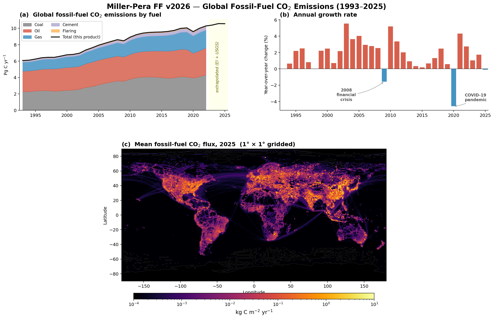

# Miller-Pera FF — Global Fossil-Fuel CO₂ Emissions

[](https://github.com/noaa-gml/miller-ff/actions/workflows/ci.yml)
[](LICENSE.md)
[](https://doi.org/10.15138/J2Y9-VC32)

Gridded 1° × 1° monthly fossil-fuel CO₂ emission estimates (1993–2025) for use as prior fluxes in atmospheric inversions (CarbonTracker, TM5-4DVar) in the NOAA GML.

Combines national inventories (**CDIAC**, **Energy Institute**, **USGS cement**) with **EDGAR** spatial patterns to produce a global, monthly, sector-resolved product.



## Quick Start

### v2026 — frozen 1993–2025 product

```bash
# Full pipeline (≈ 10 min, mostly EDGAR regridding)
python extrapolate_edgar.py          # Step 0  — extend EDGAR if needed
python ingest.py                # Step 1  — ingest & harmonise inputs
python ff_country.py            # Step 2  — gridding & seasonal cycle
python post_process.py          # Step 3  — netCDF conversion (auto-calls split_ct)
# Step 4: run verify.ipynb      # 90+ quality checks
```

### v2026b — NRT extension through April 2026 (CarbonMonitor)

```bash
# 0. Download / refresh CarbonMonitor data (idempotent; <7-day-old files are reused)
python download_carbon_monitor.py

# 1. Re-run ingest so the CM-derived ratios land in processed_inputs/
python ingest.py

# 2. Run the pipeline once per annual-baseline method (≈ 3 min each)
python ff_country.py --method assumed
python post_process.py --method assumed
python ff_country.py --method cm_yearly
python post_process.py --method cm_yearly

# 3. Generate the comparison artifact + run verify_nrt.ipynb
python compare_methods.py
jupyter nbconvert --to notebook --execute --inplace verify_nrt.ipynb
```

When CM publishes a new month (e.g., April 2026 lands in late May), re-run from step 0 with `--force` on the download to regenerate. Months CM hasn't published yet are silently skipped by the overwrite step (those cells keep the spline + seasonal-cycle output).

**Requirements:** Python 3.12, conda env `p312` — numpy, scipy, pandas, xarray, pint-xarray, cf_xarray, xesmf, netCDF4, openpyxl.

**Contact** Ashley Pera, (mailto:ashley.pera@noaa.gov)

## Data Sources

| Source | Coverage | Link |
|---|---|---|
| **CDIAC** (AppState) | National & global annual FF + cement through 2022 | [rieee.appstate.edu](https://rieee.appstate.edu/projects-programs/cdiac/) |
| **Energy Institute** | National oil / gas / coal / flaring through 2024 | [energyinst.org](https://www.energyinst.org/statistical-review) |
| **EDGAR 2025 GHG** | Gridded 0.1° sector fluxes (TOTALS, NMM, PRO_FFF) | [edgar.jrc.ec.europa.eu](https://edgar.jrc.ec.europa.eu/dataset_ghg2025) |
| **USGS Cement** | National cement production for extrapolation | [usgs.gov](https://www.usgs.gov/centers/national-minerals-information-center/cement-statistics-and-information) |
| **GISS Country Grid** | 1° country assignment map (1993 boundaries) | [data.giss.nasa.gov](https://data.giss.nasa.gov/landuse/country.html) |
| **CarbonMonitor** *(v2026b only)* | Daily NRT emissions, 36 countries + ROW + WORLD, 2019-01-01 onward | [carbonmonitor.org](https://carbonmonitor.org/) |

## Output Formats

`<method>` is the v2026b annual-baseline method — `assumed` or `cm_yearly` (see [v2026b NRT Extension](#v2026b-nrt-extension--carbonmonitor-through-april-2026)). The pipeline is run once per method.

| Format | Location | Description |
|---|---|---|
| **Monolithic** | `outputs/gml_ff_co2_2026b_<method>.nc` | All 400 months (1993-01 … 2026-04) in one file (verification & plotting) |
| **TM5 per-year** | `outputs/yearly/gml_ff_co2_2026b_<method>.{YYYY}.nc` | `fossil_imp` (time, lat, lon), float32 — 33 full years (1993–2025); the partial 2026 has no per-year file |
| **CarbonTracker per-year** | `outputs/ct/flux1x1_ff_<method>.{YYYY}.nc` | CT conventions (`date`, `date_bounds`, `decimal_date`), 33 files |
| **CarbonTracker per-month** | `outputs/ct/flux1x1_ff_<method>.{YYYYMM}.nc` | Same conventions, 400 files (1993-01 … 2026-04) |

Units: `mol m⁻² s⁻¹` on a global 1° × 1° grid (180 × 360), monthly time steps.

<details>
<summary><strong>TM5/Fortran rc settings</strong></summary>

```
ff.input.dir      = <path to outputs/yearly/>
ff.ncfile.prefix  = flux1x1_ff
ff.ncfile.varname = fossil_imp
```

Dimension order `(time, lat, lon)` maps to Fortran column-major `(lon, lat, time)` as expected by `emission_co2_ff__Miller.F90`.
</details>

## Methodology

### Global and National Totals

Annual global total fossil fuel CO₂ emissions are based on the Appalachian Energy Center's "[CDIAC at AppState](https://rieee.appstate.edu/projects-programs/cdiac/)" project [[Erb, M. & Marland G., 2026](https://doi.org/10.6084/m9.figshare.31449082),], which updates the original annual global and country fossil fuel CO₂ emissions estimates from the DOE's Carbon Dioxide Information and Analysis Center (CDIAC) [[Boden et al., 2017](
https://doi.org/10.5194/essd-13-1667-2021)]. The CDIAC at AppState emissions estimates used in this product extend through 2022, covering 189 nations across six sectors: gas, liquid fuel, solid fuel, flaring, cement, and a computed total.

### Country Harmonisation

The raw CDIAC national dataset contains 261 entities spanning the full historical record. Of these, 30 are historical entities with no data after 1993 (e.g., the former USSR, Czechoslovakia, East/West Germany) and are excluded. The remaining 231 active entities are harmonised to 189 canonical countries through three operations:

- **Renaming:** Standardises variant spellings and historical name changes (e.g., "ZAIRE" → "Democratic Republic Of The Congo").
- **Aggregation:** Merges small territories into their parent countries. For example, Eritrea is summed into Ethiopia, Timor-Leste into Indonesia, Gibraltar and Andorra into Spain, and the former Yugoslav republics (Croatia, Slovenia, Bosnia & Herzegovina, Kosovo, Serbia, Montenegro, Macedonia) are combined into a single Yugoslavia entry.
- **Deletion:** Removes 22 very small territories with incomplete records and no GISS grid cells (e.g., Cayman Islands, Palau, Montserrat).

### CDIAC Sector Interpolation

Many CDIAC country-year-sector cells are reported as NaN in the raw data — most commonly flaring (4025 NaN rows), but also gas (2432), solid fuel (2094), cement (315), and liquid fuel (48). These gaps are filled by linear interpolation within each nation's time series, with forward-fill for trailing NaN values. This is particularly important for the four French overseas departments (French Guiana, Guadeloupe, Martinique, Réunion), which have no CDIAC data after 2010 and are forward-filled from their last reported values.

After interpolation, any row where the reported total does not match the sector sum (a consequence of the original total having been computed without the then-missing sector) is recomputed as the sum of the five sectors.

### Spatial Distribution

Fossil-fuel CO₂ fluxes are spatially distributed in two steps. First, the coarse-scale country totals from CDIAC are mapped onto a 1° × 1° grid according to spatial patterns from the EDGAR v8.0 inventories [[Crippa et al., 2024](https://data.europa.eu/doi/10.2760/9816914)]. Each emission sector uses its own EDGAR spatial pattern within each country:

- **Gas / oil / coal** → combustion pattern (EDGAR TOTALS minus NMM minus PRO_FFF)
- **Cement** → NMM (non-metallic minerals manufacturing) — concentrated at cement plants
- **Flaring** → PRO_FFF (fuel exploitation) — concentrated in oil/gas-producing regions

The spatial pattern varies by year up to the end of the EDGAR v8.0 product (2022). After this, the spatial patterns are linearly extrapolated from recent trends. While EDGAR provides annual emissions estimates at 0.1° × 0.1° resolution (regridded here to 1° × 1°), their global totals do not agree with CDIAC, which we feel to be more authoritative due to being based on countries' own reporting. Therefore, only the spatial patterns in EDGAR are used, and the total emissions are rescaled to CDIAC values.

The CDIAC country-by-country totals sum to about 95% of the global total emissions; the remaining ~5% is mapped to global shipping routes according to EDGAR, which serves as a proxy for international bunker fuel emissions.

### Temporal Distribution

The pipeline converts annual emissions to monthly resolution in two stages:

1. **Integral-preserving interpolation:** A piecewise integral-preserving quadratic spline (PIQS) [[Rasmussen, 1991](https://doi.org/10.1016/0098-3004(91)90027-B)] is fit to each 1° × 1° grid cell independently. For each annual segment, a quadratic *f(t) = a(t−x)² + b(t−x) + c* is chosen such that the integral over the year equals the annual total, continuity and differentiability hold at every year boundary, and a global smoothness measure is minimised. The spline is evaluated at daily resolution and then binned into monthly means. If any day in a pixel-year goes negative (a spline artefact for rapidly declining emissions), the smooth curve is replaced with the constant annual mean for that pixel-year.

2. **Seasonal modulation:** For North America (30–60°N, 60–140°W), a seasonal cycle derived from the first and second harmonics [[Thoning et al., 1989](https://doi.org/10.1029/JD094iD06p08549)] of the Blasing et al. [[2005](https://doi.org/10.1029/2007JG000435)] analysis for the United States is applied. The Blasing analysis produces ~10% higher emissions in winter than in summer. This scheme defines a fixed fraction of emissions for each month, so while the shape of the annual cycle is invariant, the amplitude scales with the annual total. For Eurasia (30–60°N, 20°W–170°E), a separate set of seasonal emissions factors derived from EDGAR sector-resolved data is applied. The Eurasian seasonal amplitude is about 25%, significantly larger than North America, owing to the absence of a secondary summertime maximum from air conditioning. Outside these two zones, no seasonal modulation is applied.

### Extrapolation Beyond CDIAC

The full CDIAC at AppState dataset is available through 2022 and EDGAR spatial patterns through 2022 at time of production. A prior estimate of fluxes through 2025 is required to accommodate the assimilation window.

For **2023–2024**, per-country fractional increases in sectoral emissions are taken from:
1. The **Energy Institute** Statistical Review of World Energy [EI, 2025](https://www.energyinst.org/statistical-review/about) for coal, oil, gas, and flaring
2. The **USGS** National Minerals Information Center [Cement Mineral Commodity Summaries](https://www.usgs.gov/centers/national-minerals-information-center/cement-statistics-and-information) for cement

For example, to compute 2023 coal emissions for France, the EI ratio of 2023 to 2022 French coal consumption is used to scale the 2022 CDIAC value, which is then distributed using the EDGAR spatial pattern.

The EI does not report individual data for all 189 CDIAC countries. Countries without direct EI coverage are assigned to regional aggregates defined in two JSON configuration files (`EI_2024_fuel_regions.json` and `EI_2024_flaring_regions.json`). For fuels (oil, gas, coal), 76 countries have direct EI data and 113 use one of 12 regional aggregates (e.g., "Eastern Africa", "Central America", "Other Asia Pacific"). For flaring, 49 countries have direct EI data and 140 use one of 6 broader regional aggregates (e.g., "Other Africa", "Other Europe"). All countries within a regional aggregate share the same year-over-year growth rate. Where a country has NaN ratios even after regional assignment (e.g., zero base-year consumption), the global-average fractional change is used as a fallback.

Flaring uses the same per-country EI ratio mechanism as the combustion fuels: countries with direct EI flaring data get their own year-over-year CO₂-from-flaring growth rates, while countries in regional aggregates share the regional rate. For the global total extrapolation (used to compute the bunker-fuel residual), flaring volumes (BCM) are read from the EI "Natural Gas Flaring" sheet and converted to year-over-year ratios.

For **2025**, USGS cement data is available and per-country cement ratios are applied directly. For combustion fuels and flaring, assumed growth rates are applied uniformly across all countries: oil +2.5%, gas +2.5%, coal +1%, flaring +1%. These rates reflect consensus near-term projections and are configured in `ff_country.py` (step 3a′ of `main()`).

### v2026b NRT Extension — CarbonMonitor through April 2026

The frozen v2026 product (1993–2025) is post-EI / pre-CarbonMonitor. For inversion runs that need a few months into 2026 before the next EI release in mid-June, a **v2026b** product extends the time series through April 2026 using [CarbonMonitor](https://carbonmonitor.org/) (CM) near-real-time daily emissions [[Liu et al., 2020](https://doi.org/10.1038/s41597-020-00708-7)]. CM publishes country-level monthly aggregates updated approximately every 2–4 weeks; the May 2026 update covers 2019-01-01 through 2026-03-31 for 36 individual countries (all 27 EU members plus US, China, India, Japan, Russia, UK, Norway, Switzerland, Brazil) plus `ROW` and `WORLD` aggregate rows. Aviation sectors are dropped (matching the legacy IDL pipeline).

v2026b has two components:

1. **Annual baseline for 2025 → 2026.** Two methods are produced for comparison; both are valid choices.
   * `assumed` — same per-fuel rates we used for 2025 (gas/oil +2.5%, coal/flaring +1%, cement flat — USGS hasn't published 2026 yet) compounded one more year. Default and most consistent with the 2025 methodology.
   * `cm_yearly` — per-country CM Q1-2026 / Q1-2025 ratio applied uniformly across all five sectors (CM doesn't break down by fuel type). Countries not directly tracked use the `ROW` row.

   Both methods are written to disk as separate NetCDFs (`gml_ff_co2_2026b_assumed.nc` and `gml_ff_co2_2026b_cm_yearly.nc`); the choice is made at delivery time. Annual difference is ~0.25%; per-month differences ~0.5–1% in 2026.

2. **Monthly NRT overwrite for Feb–Apr 2026.** After the PIQS spline and seasonal cycle run as usual, months for which CM has both prior-year and current-year data are overwritten **per cell**:

   ```
   Feb_2026[cell] = Feb_2025[cell] × CM_YoY_ratio[country, Feb]
   Mar_2026[cell] = Mar_2025[cell] × CM_YoY_ratio[country, Mar]
   Apr_2026[cell] = Apr_2025[cell] × CM_YoY_ratio[country, Apr]   (when CM publishes April)
   ```

   The ratio for each cell is looked up by the cell's assigned canonical CDIAC country — directly tracked countries get their own CM YoY ratio, the 154 fallback countries get the CM `ROW` row, and ocean / bunker cells use the `WORLD` row. Anchoring on prior-year-same-month preserves whatever seasonal pattern the pipeline already produced for the prior year (Blasing for NAM, EDGAR-derived for Eurasia, flat elsewhere) and applies only a per-country YoY scalar on top — matching the IDL semantics in `ff_country_new2023a.pro`.

Months CM hasn't published yet (e.g., April 2026 in a pre-May CM release) are silently skipped — those slots keep whatever the spline + seasonal cycle produced. Re-running `download_carbon_monitor.py --force` followed by `ingest.py` and the pipeline picks up the new month once it lands.

The output netCDF is truncated to the partial-year boundary (April 2026), giving 400 monthly time steps. Per-year files are written for the 33 full years only; the partial 2026 is delivered through the 4 per-month CarbonTracker files (`flux1x1_ff_<method>.{2026[01..04]}.nc`).

A "method comparison" report (markdown + figure) is generated by `compare_methods.py`, and `verify_nrt.ipynb` runs three v2026b-specific sanity checks (partial-year structure, per-cell YoY overwrite verification, bounded spline-propagation noise).

### Pipeline Overview

```
CDIAC nationals ──┐
EI fuel ratios ───┤── country totals ──→ distribute onto ──→ monthly ──→ netCDF
USGS cement ──────┘   (189 countries)     1°×1° grid          via piqs
                                          (EDGAR patterns)    spline +
                                                              seasonal cycle
```

| Step | Script | What it does |
|---|---|---|
| 0 | `extrapolate_edgar.py` | Extend EDGAR spatial fields beyond their last real year (if needed) |
| 1 | `ingest.py` | Read all raw inputs, harmonise 189 country names, regrid EDGAR 0.1° → 1°, compute EI/USGS ratios |
| 2 | `ff_country.py` | Assign national emissions to grid cells, extrapolate, apply seasonal cycles |
| 3 | `post_process.py` | Convert Gg C → mol/m²/s, write per-year + monolithic netCDFs, call `split_ct.py` |
| 3b | `split_ct.py` | Reformat to CarbonTracker conventions (auto-called by step 3) |
| 4 | `verify_nrt.ipynb` | 90+ automated quality checks across 11 sections |

<details>
<summary><strong>Verification checks (90+ in 11 sections)</strong></summary>

The verification notebook (`verify_nrt.ipynb`) runs 90+ checks organised into two parts:

**Part I — Input Data Integrity (Sections 1–4)**

- **Section 1 (1a–1l):** CDIAC accounting identities, suspicious jumps, gaps, negatives, country-grid mapping, deleted-territory emission quantification, bunker fractions, Excel schema stability, aggregation drift, French department interpolation, sector-sum integrity, interpolation audit
- **Section 2 (2a–2j):** EDGAR file completeness, global-total accuracy, TOTALS ≥ NMM + PRO_FFF, real-vs-FAKE year split, inter-year continuity, negative pixels, dimension consistency, extrapolation boundary, spatial stability, NetCDF schema
- **Section 3 (3a–3o):** USGS-vs-CDIAC cement, EI country coverage, EI-vs-CDIAC validation, fractional-change plausibility, USGS year/country coverage, EI/USGS Excel schema, EI national CSV structure, fractional-change files, USGS sentinel labels, fallback coverage, flaring BCM check, per-country flaring ratio validation, region-vs-direct audit, USGS name join audit
- **Section 4 (4a–4l):** Monthly flux array shape/range, country grid coverage, fracarr integrity, GISS grid file, country list ordering, seasonal input format, piqs negative-clamp fraction, fracarr sector-index sanity, fracarr sector correlation

**Part II — Output Quality (Sections 5–11)**

- **Section 5 (5a–5h):** Global totals vs CDIAC, time series, growth rates, per-capita sanity, COVID-19 dip, post-CDIAC trend validation, assumed 2025 growth rate verification, per-sector 2024→2025 decomposition, decadal benchmarks, national-sum conservation
- **Section 6 (6a–6k):** Data quality, unit cross-verification, coordinate integrity, metadata consistency, CT-format spot-check, monthly↔yearly self-consistency, TM5 file check, calendar accuracy, coordinate bounds, float32 fidelity, CF attributes
- **Section 7 (7a–7d):** Spatial correlation with previous products, comparison maps, fractional-difference maps
- **Section 8 (8a–8l):** Hemisphere balance, sector breakdown, country-level totals, variability hotspots, COVID spatial pattern, industrial zone hot spots, flaring concentration, polar zero-check, grid-cell roundtrip, seasonal ratio map, boundary leakage, rank stability
- **Section 9 (9a–9d):** Seasonal cycle sanity, regional phasing, amplitude-vs-latitude, temporal stability
- **Section 10 (10a–10c):** Bunker fuel accounting, cement/flaring fractions, sector fraction stability
- **Section 11 (11a–11f):** Seasonal annual-mean preservation, piqs integral preservation, end-to-end Gg C roundtrip, year-boundary continuity, per-sector bunker sign, consecutive-year spatial correlation

</details>

## Directory Layout

```
miller-ff/
├── README.md
├── config.py                      # year span / input paths / version — edit for a new year
├── constants.py                   # physical constants (Earth radius, C molar mass)
├── country_names.py               # country-name harmonisation
├── download_carbon_monitor.py     # Step 0a — fetch CarbonMonitor NRT data
├── extrapolate_edgar.py           # Step 0b — extend EDGAR if needed
├── ingest.py                      # Step 1 — ingest & harmonise inputs
├── ff_country.py                  # Step 2 — gridding & seasonal cycle
├── post_process.py                # Step 3 — netCDF conversion (auto-calls split_ct)
├── split_ct.py                    # Step 3b — CarbonTracker reformat
├── compare_methods.py             # v2026b method comparison
├── verify.ipynb                   # Step 4 — 90+ quality checks
├── verify_nrt.ipynb               # v2026b method-comparison checks
├── package_delivery.py            # build the delivery bundle from source
├── tests/                         # pytest suite (unit / property / integration)
├── inputs/                        # Raw input data (paths set in config.py)
│   ├── CDIAC/                     #   CDIAC xlsx files
│   ├── EI-Stats-Review-*.xlsx     #   Energy Institute
│   ├── EI_2024_*_regions.json     #   EI region → country mappings
│   ├── TOTALS_flx_nc_2025_GHG/   #   EDGAR TOTALS
│   ├── NMM_flx_nc_2025_GHG/      #   EDGAR cement sector
│   ├── PRO_FFF_flx_nc_2025_GHG/  #   EDGAR flaring sector
│   ├── USGS_cement/               #   USGS cement CSVs
│   ├── carbon_monitor/            #   CarbonMonitor NRT CSVs
│   └── COUNTRY1X1.*               #   GISS country grid
├── processed_inputs/              # Intermediates from Step 1
├── outputs/
│   ├── yearly/                    #   Per-year TM5-format files
│   ├── ct/                        #   CarbonTracker-format files
│   ├── gml_ff_co2_2026b_<method>.nc  #   Monolithic (all years, per method)
│   └── summary_figure.png         #   README figure
└── archive/                       # Previous versions
```

---

# Production Pipeline Reference

Detailed documentation for each pipeline step. The code lives at <https://github.com/noaa-gml/miller-ff>.

## HPC / Delivered Output Directory

If you are reading this on the HPC or in a delivered output directory, the layout is:

```
./
├── README.md                          ← this file
├── split_ct.py                        ← script that produced the CT-format files below
├── flux1x1_ff_<method>.1993.nc         ← CarbonTracker-format, per-year (33 files)
├── flux1x1_ff_<method>.199301.nc       ← CarbonTracker-format, per-month (400 files)
├── ...
├── flux1x1_ff_<method>.2026.nc
├── flux1x1_ff_<method>.202604.nc
└── from_gml/
    └── gml_ff_co2_2026b_<method>.nc     ← monolithic source file (all months, all variables)
```

`<method>` is `assumed` or `cm_yearly` — the v2026b annual-baseline method.

### CarbonTracker-Format Files (`flux1x1_ff_<method>.*.nc`)

| Pattern | Description |
|---|---|
| `flux1x1_ff_<method>.{YYYY}.nc` | Per-year CarbonTracker-format. Variable `fossil_imp` (date, lat, lon) with `decimal_date`, `date_components`, `date_bounds`. 33 files (full years 1993–2025). |
| `flux1x1_ff_<method>.{YYYYMM}.nc` | Per-month CarbonTracker-format. Same variables, 400 files (1993-01 … 2026-04). |

CarbonTracker conventions:
- Time dimension named `date` (midpoint of each month)
- `date_bounds` (month start/end), `decimal_date` (leap-year aware fractional year)
- `date_components` / `calendar_components` (integer year, month, day, etc.)
- CarbonTracker global attributes (Notes, disclaimer, contact info)
- Only `fossil_imp` + coordinate bounds (no diagnostic variables)

### Monolithic Source File (`from_gml/gml_ff_co2_2026b_<method>.nc`)

All 400 months in one file, used as input to `split_ct.py`. Contains `fossil_imp` (mol/m²/s) and `fossil_imp_cell` (mol/cell/yr), 1°×1°, monthly 1993-01 through 2026-04.

### TM5/Fortran Per-Year Files (in the development repo)

The per-year TM5-format files (`gml_ff_co2_2026b_<method>.{YYYY}.nc`) are generated during production but are **not** included in this HPC directory. They live in the development repo under `outputs/yearly/`. If you need them, see the repository.

The NetCDF dimension order `(time, lat, lon)` maps to the Fortran column-major buffer `ff_input(nlon360, nlat180, 12)` = `(lon, lat, time)` as expected.

## Step 0: Extrapolate EDGAR (optional)

**`extrapolate_edgar.py`** — Only needed when EDGAR doesn't cover the final year. Runs over all three sector directories (TOTALS, NMM, PRO_FFF). For each sector it auto-detects the latest real file, estimates a growth rate from the last 3 real years of data, and writes "FAKE" placeholder files through `LAST_PIPELINE_YEAR`. Skips years that already have a FAKE file. Includes read-back verification.

```bash
python extrapolate_edgar.py
```

- **Inputs:** Latest non-FAKE file in each of `inputs/TOTALS_flx_nc_2025_GHG/`, `inputs/NMM_flx_nc_2025_GHG/`, `inputs/PRO_FFF_flx_nc_2025_GHG/` (auto-detected per sector)
- **Output:** `EDGAR_2025_GHG_CO2_{YYYY}_{SECTOR}_FAKE_flx.nc` in each sector directory, for each year beyond EDGAR coverage through `LAST_PIPELINE_YEAR`
- **Config:** `LAST_PIPELINE_YEAR` (default 2025), `N_YEARS_FOR_RATE` (default 3), `FALLBACK_RATE` (default 0.01)
- **When to skip:** If all three sector directories already have real or FAKE files through the final extrapolation year

## Step 1: Ingest & Process Input Data

**`ingest.py`** — The main data-preparation script. Reads all raw inputs, harmonizes country names, computes fractional change ratios, regrids EDGAR 0.1° → 1°, and writes processed intermediates. Takes ~5 minutes (EDGAR regridding is the bottleneck).

```bash
python ingest.py
```

**Inputs read:**
- `inputs/CDIAC/global.1751_2021.xlsx` — global totals
- `inputs/CDIAC/nation.1751_2021.xlsx` — national totals
- `inputs/EI-Stats-Review-ALL-data-2025.xlsx` — EI oil/gas/coal/flaring
- `inputs/TOTALS_flx_nc_2025_GHG/*.nc` — EDGAR gridded fluxes (all sectors combined)
- `inputs/NMM_flx_nc_2025_GHG/*.nc` — EDGAR NMM sector (cement spatial pattern)
- `inputs/PRO_FFF_flx_nc_2025_GHG/*.nc` — EDGAR PRO_FFF sector (flaring spatial pattern)
- `inputs/USGS_cement/mcs????-cement.csv` — USGS cement CSVs
- `inputs/EI_2024_flaring_regions.json` — mapping of EI flaring region names → CDIAC countries
- `inputs/EI_2024_fuel_regions.json` — mapping of EI fuel region names → CDIAC countries
- `inputs/COUNTRY1X1.1993.mod.txt` — GISS country grid
- `inputs/COUNTRY1X1.CODE.mod2.2013.csv` — country code mapping

**Outputs written to `processed_inputs/`:**
| File | Description |
|---|---|
| `CDIAC_global_2020.csv` | Global annual totals (Gg C): total, gas, liquid, solid, flaring, cement |
| `CDIAC_national_2020.csv` | National annual totals (Gg C), same columns |
| `CDIAC_countries.csv` | Ordered list of country names |
| `EI_frac_changes_2020-2024_{fuel}.csv` | Year-over-year fractional changes per country (gas/oil/coal) |
| `EI_frac_changes_2020-2024_global_{fuel}.csv` | Global year-over-year fractional changes |
| `EI_national_2024.csv` | EI data mapped to CDIAC countries |
| `EI_flaring_bcm.csv` | Global flaring volumes in BCM from EI (used by ff_country for flaring ratios) |
| `USGS_cement_2026b.csv` | Merged USGS cement production data |
| `USGS_cement_ratios_2020-2026b.csv` | Cement production ratios relative to 2020 |
| `edgar_patterns.npz` | Sector-specific normalized EDGAR spatial fractions (180×360×nyears×3: combustion/flaring/cement) + TOTALS pattern for bunker fuels |

## Step 2: Country-Level Gridding

**`ff_country.py`** — The core gridding routine. Assigns national emission totals to 1°×1° grid cells using sector-specific EDGAR spatial patterns (combustion for gas/oil/coal, NMM for cement, PRO_FFF for flaring), extrapolates beyond CDIAC using EI fuel ratios and per-country USGS cement ratios, adds "bunker" emissions to ocean cells, interpolates annual→monthly via Rasmussen (1991) integral-preserving quadratic splines, and applies Blasing et al. seasonal cycles for N. America and Eurasia.

```bash
python ff_country.py
```

- **Key parameters** (configured near top of `main()`):
  - `yr_start = 1993` — first year
  - `yr_cdiac = 2021` — last CDIAC year
  - `yr_ei = 2024` — last EI year
  - `yr_final = 2025` — final extrapolation year
  - Seasonal cycles: N. America ("nam") and Eurasia ("euras")

- **Spatial distribution:** Each sector uses its own EDGAR pattern within each country:
  - Gas / oil / coal → combustion pattern (TOTALS minus NMM minus PRO_FFF)
  - Flaring → PRO_FFF (fuel exploitation) — concentrated in oil/gas-producing regions
  - Cement → NMM (non-metallic minerals) — concentrated at cement plants
  - Bunker fuels (global minus sum-of-countries) → TOTALS pattern over ocean cells

- **Extrapolation approach:**
  - Gas / oil / coal use per-country EI ratios for 2023–2024, then assumed growth rates for 2025 (gas +2.5%, oil +2.5%, coal +1%)
  - Flaring uses global EI ratios for 2023–2024, then assumed +1% for 2025
  - Cement uses per-country USGS ratios for all extrapolation years (2023–2025)
  - Global totals are extrapolated independently using the same source ratios
  - Assumed 2025 rates are configured in step 3a′ of `main()` — update these when better data becomes available

- **Inputs:** All files from `processed_inputs/` (CDIAC, EI, USGS cement ratios, EDGAR spatial patterns, CarbonMonitor ratios)
- **Output:** `outputs/ff_monthly_2026b_<method>_py.npz`

## Step 3: Post-Process to netCDF

**`post_process.py --method <method>`** — Loads the `.npz` output from Step 2, converts units (Gg C → mol/m²/s), cross-validates the conversion against an independent pint-based computation, truncates to the partial-year boundary (April 2026), and writes:

1. **Per-year files** to `outputs/yearly/` — one `.nc` per full year, dims `(time, lat, lon)`, variable `fossil_imp`, float32. These are the files TM5 reads. The partial final year (2026) has no per-year file.
2. **Monolithic file** `outputs/gml_ff_co2_2026b_<method>.nc` — all 400 months in one file for verification and plotting.
3. Calls `split_ct.py` to produce CarbonTracker-format files (see below).

Built-in verification checks: input quality (NaN/Inf/negative), cell areas sum to 4πR², time monotonicity, global totals (5–15 PgC/yr, <20% YoY change), round-trip read-back, cross-validation with pint-based unit chain.

```bash
python post_process.py --method assumed      # or --method cm_yearly
```

- **Input:** `outputs/ff_monthly_2026b_<method>_py.npz`
- **Output:** `outputs/yearly/gml_ff_co2_2026b_<method>.{YYYY}.nc` (33 full-year files), `outputs/gml_ff_co2_2026b_<method>.nc`

## Step 3b: CarbonTracker-Format Split

**`split_ct.py --method <method>`** — Reads the monolithic `outputs/gml_ff_co2_2026b_<method>.nc` and writes CarbonTracker-format per-year and per-month files. Automatically called by `post_process.py`, but can also be run standalone.

Output format:
- Time dim named `date` (midpoint of each month)
- `date_bounds`, `decimal_date` (leap-year aware), `date_components` (int32), `calendar_components` (int32)
- CarbonTracker global attributes (Notes, disclaimer, etc.)
- Only `fossil_imp` (float32, zlib compressed) + coordinate bounds
- Validates file counts on output (the partial final year has fewer than 12 months)

```bash
python split_ct.py --method assumed           # or --method cm_yearly
```

- **Input:** `outputs/gml_ff_co2_2026b_<method>.nc`
- **Output:** `outputs/ct/flux1x1_ff_<method>.{YYYY}.nc` (33 files), `outputs/ct/flux1x1_ff_<method>.{YYYYMM}.nc` (400 files)

Comparison checks are in `verify_nrt.ipynb` (Check 6e).

## Step 4: Verify

**`verify_nrt.ipynb`** — 90+ checks in 11 sections, split into two parts:

**Part I — Input Data Integrity (Sections 1–4)**

*Section 1 — CDIAC Data Checks (1a–1l):*
- **1a.** CDIAC accounting identities — sector sums ≈ national totals; national sum + bunkers = global total
- **1b.** Suspicious year-over-year jumps in nationals (> 30% for significant emitters)
- **1c.** Gaps in country records — nations with missing years between first and last appearance
- **1d.** Negative emission values — negative totals (critical, data corruption) and negative sector values (gas/liquid/solid/flaring/cement; total can still be positive, e.g. Estonia liquid_fuel 2018–2021)
- **1e.** Country-to-grid mapping completeness — verifies positional alignment between the CDIAC country list and the GISS code table (ff_country matches by position, not by name), then checks that each country's assigned code maps to ≥1 grid cell; countries with 0 cells have emissions silently dropped. Name differences (e.g. 'Russia' vs 'RUSSIAN FEDERATION') are shown as informational, not failures.
- **1e′.** Emissions lost to deleted territories — loads the raw CDIAC xlsx and sums emissions from the 22 small territories deleted during ingestion (Cayman Islands, Palau, Montserrat, etc.) because they have no GISS grid cells; shows per-territory breakdown and fraction of global total (~800 Gg C/yr, 0.008%; pass if < 0.1%)
- **1f.** Bunker fraction plausibility — global minus national sum should be 2–8% of total with no sudden jumps
- **1g.** Country zero-emission transitions — significant CDIAC emitters that drop to zero (data truncation check)
- **1h.** CDIAC Excel schema integrity — sheet name 'Sheet1' present; all expected column headers intact (detects renamed/reordered columns in future CDIAC releases)
- **1i.** CDIAC aggregation & rename drift — "little" country names (Eritrea, Gibraltar, Lesotho, etc.) and old CDIAC spelling variants (Russian Federation, Viet Nam, etc.) must be absent from the processed CSV; if present, a country name changed in a new CDIAC release and the aggregation/rename silently missed it
- **1j.** French departments interpolation sanity — French Guiana, Guadeloupe, Martinique, Réunion have non-zero, monotonically-increasing values in 2011–2014 (confirming the ingest NaN-then-interpolate step ran correctly)
- **1k.** CDIAC sector-sum integrity (processed data) — strict check that every row in the processed `CDIAC_national_2020.csv` has |sector_sum − total| ≤ 1 Gg C; verifies that `ingest.py`'s total-recomputation fix covered all cases. Complements check 1a (which only flags large emitters at 5%).
- **1l.** CDIAC interpolation audit — loads the raw CDIAC xlsx and compares with the processed CSV to identify every (nation, year, sector) cell that was NaN in the raw data and non-zero after ingest's linear interpolation. Reports counts by sector and lists affected countries and year ranges. Flaring entries are highlighted because the raw total column does not include interpolated flaring values, making the total-recomputation in ingest critical.

*Section 2 — EDGAR Spatial Input Checks (2a–2j):*
- **2a.** File completeness — all three sectors (TOTALS, NMM, PRO_FFF) cover the same years
- **2b.** `global_total` attribute accuracy — parsed Gt value matches actual pixel sum to < 2%
- **2c.** TOTALS ≥ NMM + PRO_FFF at every pixel (version mismatch detection)
- **2d.** Real-vs-FAKE year split — count of real vs extrapolated files per sector; flag if > 3 FAKE years
- **2e.** Inter-year global total continuity — among real files, flag > 20% year-over-year change
- **2f.** Negative pixel values — sample check on most recent real year per sector
- **2g.** File dimension consistency — all files in each sector directory must have identical grid shape
- **2h.** Extrapolation boundary — growth rate continuity at real→FAKE transition year
- **2i.** Spatial pattern stability of extrapolated years (r ≈ 1.0 across all three sectors)
- **2j.** EDGAR NetCDF variable & grid schema — `fluxes` variable present, `year`/`units` attributes intact (`kg m-2 s-1`), grid shape (1800, 3600); catches variable renames between EDGAR releases

*Section 3 — EI & USGS Input Checks (3a–3n):*
- **3a.** USGS cement vs CDIAC cement — clinker-converted world total agrees within ±30%
- **3b.** EI country coverage vs CDIAC — classifies each CDIAC country as direct or regional EI data; flags large emitters (avg > 1000 Gg C/yr) relying on regional rates
- **3c.** EI vs CDIAC 2021 validation — apply 2021 EI ratios to 2020 CDIAC nationals; compare to actual (< 5% error)
- **3d.** EI fractional change plausibility — flag ratios > 3× or < 0.2× that would produce unrealistic extrapolations
- **3e.** USGS cement year coverage — ratios available for all pipeline extrapolation years (2022–2025)
- **3f.** USGS cement major country coverage — top cement producers (China, India, USA, etc.) present
- **3g.** EI Excel sheet & year column schema — all 4 required sheets present ('Primary Energy Cons (old meth)', 'Gas/Coal Consumption - EJ', 'CO2 from Flaring'), 'Total World' row found, last year column = expected `LAST_EI_YEAR`; catches sheet renames between annual EI releases
- **3h.** USGS cement CSV column schema — 'Nation' column present, cement columns follow `'Cement YYYY (Gg)'` format, no suppressed/withheld ('W', '--') values
- **3i.** EI national CSV year coverage & structure — `EI_national_2024.csv` has all 4 fuel columns, all years from 1993–`LAST_EI_YEAR`, country count matches CDIAC, base year `LAST_CDIAC_YEAR − 1` present (required for `pct_change` ratio), no NaN in extrapolation years
- **3j.** EI fractional change file completeness — `EI_frac_changes_*_{gas,coal,oil}.csv` have all extrapolation year columns, correct country count, no NaN/Inf, all ratios positive
- **3k.** USGS cement sentinel label stability — `'World total (rounded)'` and `'Other countries (rounded)'` present in merged CSV; these strings are hard-coded in ingest — if USGS renames them in a future edition the pipeline silently mis-computes
- **3l.** USGS cement fallback coverage — identifies which CDIAC countries fall back to the global 'Other countries' cement ratio (case-insensitive name matching); ranks fallback countries by CDIAC cement emissions
- **3m.** Global flaring BCM ratios vs EI national flaring — compares year-over-year direction of BCM volumes (from `EI_flaring_bcm.csv`, used for global total extrapolation) against EI TG CO₂ flaring totals; flags years where BCM and EI point in opposite directions
- **3m2.** Per-country flaring ratios validation — checks `EI_frac_changes_2020-2024_flaring.csv` shape (189 × 3), absence of NaN, plausible range [0.3, 3.0], emission-weighted mean vs global BCM ratio (expect < 10% difference), and confirms direct-EI countries show more ratio variation than regional-aggregate countries
- **3n.** USGS cement name join audit — reads all raw USGS cement CSVs, applies `USGS_RENAMES`, and checks whether each country name (after renaming, title-cased) exactly matches a CDIAC country; USGS entries that fail to match have their cement data silently replaced by the global `'Other countries'` average. Complements check 3l (CDIAC-side fallback) with the USGS-side view.

*Section 4 — Processed Intermediate Checks (4a–4l):*
- **4a.** Monthly flux array (`ff_monthly_2026b_<method>_py.npz`) — shape, time span, non-negativity, spatial coverage
- **4b.** Country grid land cell coverage — unique codes, ocean fraction, suspicious high-flux unassigned cells
- **4c.** `edgar_patterns.npz` integrity — shape, value range [0, 1], no NaN
- **4d.** GISS country grid file integrity — `COUNTRY1X1.1993.mod.txt` reshapes to (180, 360), code range valid, ocean fraction 55–80%, all code-table entries represented in the map
- **4e.** Country list ordering consistency — `processed_inputs/CDIAC_countries_2021.txt` and `processed_inputs/CDIAC_countries.csv` must have identical country names in the same positional order (ff_country relies on positional alignment between these two files)
- **4f.** Seasonal cycle input file format & amplitude — Blasing file (`emis_mon_usatotal_2col.txt`) has ≥ 24 rows and amplitude `(max−min)/mean < 1.0` (otherwise `1 + seasff` could go negative); Eurasian file (`eurasian_seasff.txt`) has exactly 12 rows with all scale factors in 0.3–3.0
- **4g.** Piqs negative-clamp fraction — detects pixel-years where all 12 monthly values are identical and non-zero (the spline produced a negative daily value and ff_country substituted the flat annual mean); bar chart by year, red if clamped fraction > 2%
- **4h.** fracarr sector index sanity — verifies that the three layers of `edgar_patterns.npz` are in the expected order (0 = combustion, 1 = flaring, 2 = cement) by computing Spearman rank correlation between each layer and its corresponding EDGAR source (TOTALS−NMM−PRO_FFF, PRO_FFF, NMM respectively); a layer-order swap would silently mis-assign flaring to cement locations, undetectable from global totals
- **4k.** Piqs negative-clamp fraction threshold — warns if > 1.5% of land pixels are clamped in any year
- **4l.** fracarr sector correlation — for each sector, computes Pearson correlation between the fracarr layer and the independently-loaded EDGAR source field (area-weighted, normalized, with combustion = TOTALS − NMM − PRO_FFF replicated); r < 0.90 is a warning

**Part II — Output Quality Checks (Sections 5–11)**

*Section 5 — Global Totals & Trends (5a–5h):*
- **5a.** Global totals vs CDIAC (should match for 1993–2021)
- **5b.** Global totals time series plot
- **5c.** Year-over-year growth rates
- **5d.** Per-capita emissions sanity check — top 10 emitters vs expected tC/person/yr benchmarks
- **5e.** 2020 COVID-19 dip — CDIAC 2020 drop vs 2019 (expected −6 to −8%), also verified in output
- **5f.** Post-CDIAC trend validation — 2022–2024 year-over-year changes vs EI-implied growth
- **5f′.** Assumed 2025 growth rate verification — checks that the assumed sector rates (gas +2.5%, oil +2.5%, coal +1%, flaring +1%, cement from USGS) propagated correctly; compares output 2024→2025 YoY against expected weighted change from sector shares (pass if within 1 pp)
- **5f″.** Per-sector 2024→2025 decomposition — table showing each sector's CDIAC 2022 base → estimated 2024 → estimated 2025 with absolute Gg C change and percentage; identifies whether combustion growth outweighs the USGS cement decline
- **5g.** Decadal growth rate benchmarks — 1993–2000, 2000–2010, 2010–2020 vs published literature
- **5h.** National-sum conservation at CDIAC→EI boundary — for 2023–2024, applies per-country EI fractional changes (gas, oil, coal, flaring) and USGS cement ratios to CDIAC 2022 country totals, scales by the bunker fraction, and compares against the output global total (expect ratio ≈ 1.00 within 2%); catches countries lost or double-counted in `ff_country.py`'s extrapolation loop

*Section 6 — Output Data Integrity & Format (6a–6k):*
- **6a.** Data quality (NaN, negatives, spatial sanity)
- **6b.** Unit chain cross-verification (fossil_imp_cell ↔ fossil_imp_area)
- **6c.** Time & grid coordinate integrity
- **6d.** Cross-variable & metadata consistency
- **6e.** CarbonTracker-format file spot-check (file counts, required variables, time axis integrity)
- **6f.** CT monthly → yearly file self-consistency (sum of 12 monthly files = yearly file)
- **6g.** TM5 yearly file spot-check — per-year `.nc` files in `outputs/yearly/` exist and have expected shape
- **6h.** `month_lengths` calendar accuracy — February of every leap year = 29×86400 s, non-leap = 28×86400 s; each year's 12 monthly lengths sum to its `year_length` (catches calendar offset bugs if time indexing drifts by one month)
- **6i.** Coordinate bounds coverage & contiguity — `lat_bnds` spans exactly -90 to +90, `lon_bnds` spans -180 to +180, each pair of adjacent bounds shares an edge (no gaps or overlaps), all widths uniformly 1°
- **6j.** float32 encoding fidelity of per-year TM5 files — for three sample years (first, middle, last), compare float32 per-year files to float64 monolithic; max relative error < 1e-5 (typical float32 ≈ 6×10⁻⁸), no underflow pixels (mono>0 but yr=0)
- **6k.** CF global attribute completeness & source provenance — `Conventions='CF-1.8'`, `title`/`source`/`history`/`institution` all present and non-empty, `source` contains CDIAC/EI/EDGAR/USGS keywords, `earth_radius` variable = 6371.009 km (John Miller's value)

*Section 7 — Comparison with Previous Products (7a–7d):*
- **7a.** Spatial correlation with previous products (r > 0.60 for cross-version)
- **7b.** Comparison with Miller's (John's) previous product
- **7c.** Static year-by-year comparison maps (2026b vs 2025a)
- **7d.** Percentage fractional-difference map

*Section 8 — Spatial Analysis (8a–8l):*
- **8a.** Hemisphere balance & top emitters
- **8b.** Sector breakdown — CDIAC stacked bar by fuel type + combustion/flaring/cement spatial patterns
- **8c.** Country-level totals vs CDIAC top 10 emitters (per-country ratio check)
- **8d.** Interannual variability hotspots — std dev and CV maps, top high-variance cells
- **8e.** 2020 COVID-19 anomaly spatial pattern — global drop and regional distribution
- **8f.** Top-emitting pixels in known industrial zones — US, China, Europe, India hot spots
- **8g.** Flaring spatial concentration — top 10% of cells should hold > 85% of flaring pattern (Gini-like)
- **8h.** Antarctica / polar cells zero check — no emissions below 75°S above threshold (1e-10)
- **8i.** Grid-cell roundtrip (all CDIAC countries) — for three representative years (1993, 2010, 2021), sums `fossil_imp` over each country's grid cells and compares against CDIAC national total (tolerance ±5%); extends check 8c (top-10 only) to all countries; flags countries where grid sum is zero but CDIAC has non-zero emissions (silent data drop)
- **8j.** DJF/JJA seasonal ratio map — catches hemisphere-flip bugs; checks NH median ratio > 1.1
- **8k.** Country boundary emission leakage — measures border spillover for top 10 emitters using binary dilation
- **8l.** Emission rank stability — tracks top 15 countries' rankings over time, flags jumps > 5 positions

*Section 9 — Seasonal & Temporal Analysis (9a–9d):*
- **9a.** Seasonal cycle sanity
- **9b.** Regional seasonal cycle — N. America, Eurasia, S. Hemisphere amplitude & phasing
- **9c.** Seasonal amplitude vs latitude — core zone (30–60°N) amplitude > 3× tropical, minimum > 10%, peaks in January
- **9d.** Seasonal cycle temporal stability — early vs late decade Pearson r (cycle shape should be stable over time)

*Section 10 — Sector & Source Accounting (10a–10c):*
- **10a.** Bunker fuel accounting — ocean-cell sum vs CDIAC bunker residual (tolerance ±1%)
- **10b.** Cement and flaring sector fractions of global total (cement 3–8%, flaring 1–5%)
- **10c.** Sector fraction stability — cement/flaring/combustion % smoothness over time (no sudden jumps)

*Section 11 — Pipeline Transformation Checks (11a–11f):*
- **11a.** Seasonal cycle annual-mean preservation — verifies `mean(1+seasff) ≈ 1.0` (NAM Blasing) and `mean(seasffa) ≈ 1.0` (Eurasian); also checks that NAM and Eurasian longitude regions do not overlap (which would double-modulate cells)
- **11b.** Per-pixel piqs integral preservation after clamping — verifies that the 12 monthly values reconstruct the annual mean for every pixel-year, and that no negative values survive the piqs clamp
- **11c.** End-to-end Gg C roundtrip — integrates the final NetCDF (`mol/m²/s × cell_area × month_seconds`), converts back to Gg C, and compares against CDIAC input totals (tolerance 0.1%); closes the full unit-conversion loop
- **11d.** December→January monthly continuity at year boundaries — flags year-boundary jumps that exceed 3× the within-year p99 month-to-month variation (catches off-by-one in seasonal tile, clamp-induced discontinuities)
- **11e.** Per-sector bunker residual sign — verifies that global − Σ(countries) is non-negative for each sector (gas, oil, coal, flaring, cement); a negative residual means ocean cells have negative sector emissions baked into their total
- **11f.** Spatial correlation between consecutive years — Pearson r of annual-mean grids between all adjacent years (should be > 0.99); catches catastrophic spatial errors that cancel in global totals

## Updating for a New Year

The pipeline scripts are year-agnostic — there is **nothing to copy or
rename**. A new production year is a single-file edit of `config.py`
plus dropping in the new input data.

### 1. Acquire new input data

- [ ] Latest **EI Statistical Review** xlsx → `inputs/EI-Stats-Review-ALL-data-{year}.xlsx`
- [ ] Check **CDIAC** at AppState for a new national/global xlsx → `inputs/CDIAC/`
- [ ] Latest **USGS cement MCS** → `inputs/USGS_cement/mcs{year}-cement.csv`
- [ ] Check **EDGAR** for updated TOTALS / NMM / PRO_FFF sector files → the
      `inputs/{SECTOR}_flx_nc_*_GHG/` directories
- [ ] `python download_carbon_monitor.py` to refresh the CarbonMonitor CSV
- [ ] Update `inputs/EI_2024_*_regions.json` if EI changes its country groupings

### 2. Edit `config.py`

Everything that changes year to year lives in one file. Bump the year
span, the product version, and any input paths whose provider-stamped
filename changed:

```python
LAST_EI_YEAR     = 2025          # ← increment as new data lands
LAST_CM_YEAR     = 2027          # ← the new partial final year
PRODUCT_VERSION  = "2027"        # ← drives every output filename
EI_XLSX          = "inputs/EI-Stats-Review-ALL-data-2026.xlsx"   # ← new release
# … CDIAC / EDGAR / USGS paths likewise
SOURCE_STRING    = "…"           # ← refresh the provenance string
```

The assumed beyond-EI growth rates still live in `ff_country.py`
(`_assumed` in `main()`) — adjust them if near-term projections move.

### 3. Run the pipeline

```bash
python extrapolate_edgar.py      # Step 0 — only if EDGAR lacks the new year
python ingest.py                 # Step 1
python ff_country.py  --method assumed       # Step 2
python post_process.py --method assumed      # Step 3 (auto-calls split_ct)
# … repeat Steps 2-3 with --method cm_yearly for the NRT comparison
```

Then verify (`verify.ipynb`, `verify_nrt.ipynb`) and run `pytest`.

### 4. Archive the previous version

```bash
mv outputs/ff_monthly_<oldver>_*_py.npz   archive/outputs/
mv processed_inputs/edgar_patterns.npz    archive/processed_inputs/
# Keep the previous gml_ff_co2_*.nc — the verify notebooks diff against it.
```
